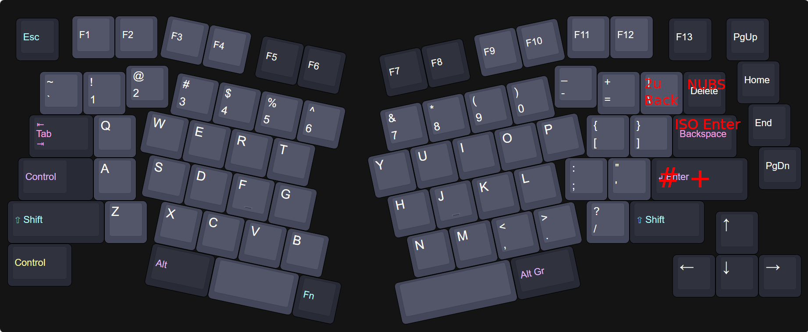

# 𝕬𝖉𝖊𝖑𝖍𝖊𝖎𝖉 - ISO (untested)

The Adelheid is a 75% Alice-like keyboard.  
It's a fork of FateNozomi's Arisu files: [Arisu PCB](https://github.com/FateNozomi/arisu-pcb) &amp; [Arisu case](https://github.com/FateNozomi/arisu-case)

<!--  -->

This repository includes files for:

- the Adelheid PCB &rarr; [README.md](./pcb/README.md)
- a layered case &rarr; [README.md](./case/README.md)
- a wrist rest &rarr; [README.md](./wrist-rest/README.md)

## Changes in this fork

added optional 2u backspace and ISO Enter

## Layout

A spaced 75% layout on top of the Alice/Arisu-layout with an ISO enter.

## Firmware

In the QMK repository: <https://github.com/qmk/qmk_firmware/tree/master/keyboards/adelheid>  
And the online configurator: https://config.qmk.fm/#/adelheid/LAYOUT

## Miscellaneous

The ISO files are untested.
